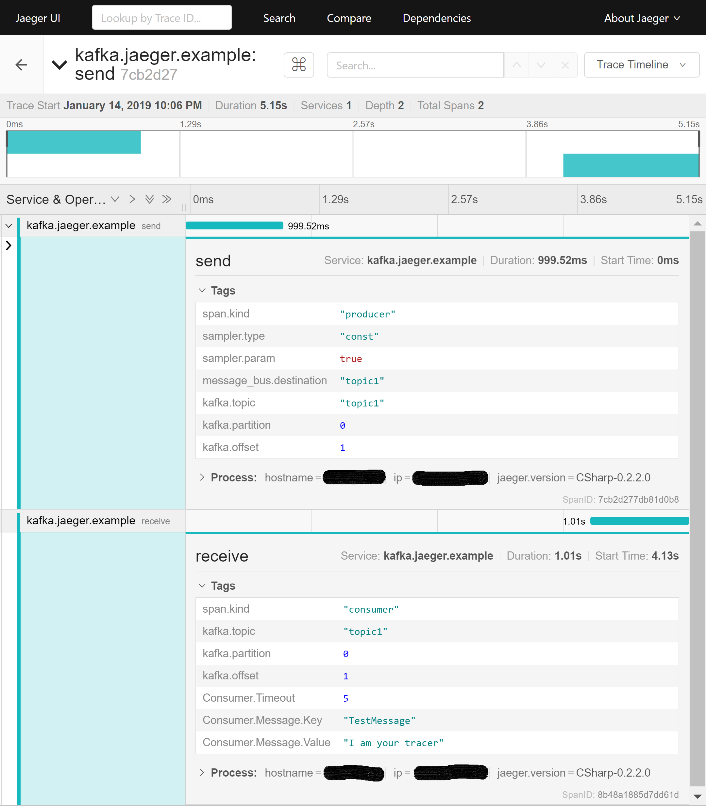

# OpenTracing.Confluent.Kafka
OpenTracing Kafka Client contains a simple extension of the <a href="https://github.com/opentracing/opentracing-csharp" target="_blank">OpenTracing</a> `ITracer` for injecting and extracting continues asynchronus spans and decorators for traceable <a href="https://github.com/confluentinc/confluent-kafka-dotnet" target="_blank">Confluent.Kafka</a> consumers and producers.

*A caught asynchronus trace over kafka*

## Download
https://www.nuget.org/packages/opentracing-kafka-client

## Usage
See <a href="https://github.com/Fresa/opentracing-kafka-client/tree/master/examples/Confluent.Kafka.Producer.And.Consumer.Traced.By.Jaeger" target="_blank">Example</a>. It uses Kafka and Jaeger. To setup the infrastructure for the example see <a href="https://github.com/Fresa/opentracing-kafka-client/tree/master/examples/Infrastructure">Running Kafka within Docker and Kubernetes</a>.

